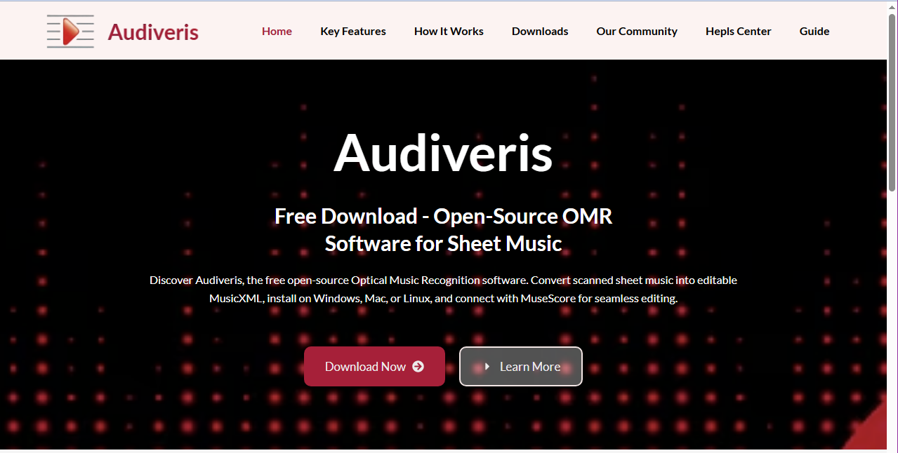

# audiveris.github.io
The Audiveris organization is hosted on GitHub at [https://github.com/Audiveris](https://github.com/Audiveris).

Within this organization, several repositories are publicly available:
| Repository | Comments |
| :---       | :---     |
| [audiveris](https://github.com/Audiveris/audiveris) | Latest generation of Audiveris OMR application |
| [proxymusic](https://github.com/Audiveris/proxymusic) | Java mapping library for MusicXML <br> This is a stand-alone library to export Java objects in MusicXML <br> Used by Audiveris OMR  |
| [omr-dataset-tools](https://github.com/Audiveris/omr-dataset-tools) | Reference of OMR data <br> This repository is now used to train a YOLO model |
| [audiveris-eg](https://github.com/Audiveris/audiveris-eg) | Earlier Generation of Audiveris OMR application <br> No longer in use, kept for history, |
| [docs](https://github.com/Audiveris/docs) |A single location for main documentation artifacts |
| [audiveris.github.io](https://github.com/Audiveris/audiveris.github.io) | The page you are reading |

# WARNING
### Fraudulent site [audiveris.com](https://audiveris.com/)!

```diff
- The site https://audiveris.com  (note the `.com` instead of the `.org` extension) seems to be a fraudulent site.
```



```diff
- The site is aesthetically pleasing and looks like an advertisement for Audiveris software.
- However, users report that links redirect to pages dedicated to cryptocurrencies, sports betting, and other online distractions.
- It has all the hallmarks of a phishing site…
```